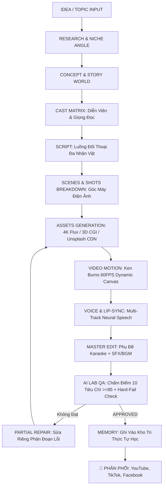
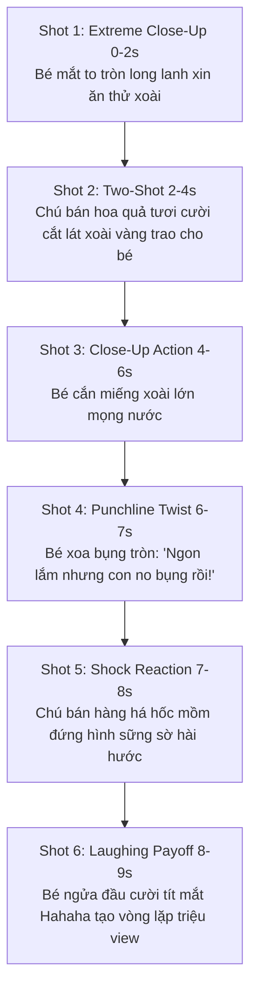

# 📦 MASTER PROJECT CONTEXT & HANDOVER DOCUMENT (DÀNH CHO AI & DEVELOPER TIẾP NHẬN)

> **TÀI LIỆU NÀY LƯU TRỮ TRỌN VẸN TOÀN BỘ QUÁ TRÌNH PHÁT TRIỂN, KIẾN TRÚC HỆ THỐNG, TRIẾT LÝ CỐT LÕI VÀ HƯỚNG DẪN VẬN HÀNH ĐỂ BẤT KỲ AI NÀO KHI MỞ DỰ ÁN LÊN ĐỀU CÓ THỂ ĐỌC HIỂU 100% CÔNG VIỆC ĐÃ LÀM VÀ TIẾP TỤC PHÁT TRIỂN MÀ KHÔNG BỊ MẤT CONTEXT.**

---

## 🎯 1. TỔNG QUAN HỆ THỐNG & TRIẾT LÝ CỐT LÕI

- **Tên Hệ Thống:** **AI Video Director & Autonomous Video Factory (Social Content Multi-Publisher)**.
- **Kho Mã Nguồn GitHub:** [https://github.com/sgswebvn/2026-7-appmxh.git](https://github.com/sgswebvn/2026-7-appmxh.git) (Nhánh `main`).
- **Địa chỉ Vercel Production:** [https://2026-7-appmxh.vercel.app/](https://2026-7-appmxh.vercel.app/)
- **Địa chỉ Localhost:** `http://localhost:3000` (Tài khoản Admin: `admin@admin.com` / `admin123`).

### 🌟 TRIẾT LÝ THIẾT KẾ ĐỐI TƯỢNG:
> **"A VIDEO IS NOT A COLLECTION OF IMAGES. A VIDEO IS A SEQUENCE OF CHARACTER PERFORMANCES."**
- **Không bao giờ tạo ảnh trước:** Hệ thống tuyệt đối không sinh ảnh đơn lẻ trước rồi mới cố gán câu chữ vào.
- **Quy trình chuẩn mực:**
  ```text
  TOPIC → STORY WORLD → CHARACTER CAST → RELATIONSHIPS → DIALOGUE → SCENES → SHOTS → PERFORMANCE → VIDEO
  ```

---

## 🔄 2. CHU TRÌNH TỰ HÀNH 12 BƯỚC (12-STEP STATE MACHINE)



---

## 🏢 3. KIẾN TRÚC 5 KHÔNG GIAN LÀM VIỆC (5 CORE WORKSPACES)

Hệ thống được tổ chức trực quan thành 5 Không Gian Chuyên Nghiệp trên giao diện và backend:

### 🏭 1. FACTORY WORKSPACE (`public/index.html` -> `#gemini-tab`)
- **Nhiệm vụ:** Nhập chủ đề video đơn giản (VD: *"Video ngắn về mì ramen"* hoặc *"Cute baby talking about mango 🥭"*).
- **Tính năng:**
  - 1-Click Master Pipeline (`triggerMasterAutoPipeline`): Tự động hóa toàn bộ 12 giai đoạn.
  - Tự động quét xu hướng trực tiếp từ TikTok Creative Center & YouTube Trends (`scanLiveTrends`).
  - Chọn Persona: Alexander Tech, Minh Anh Tài Chính, Linh Travel, Kenji Anime, **Bé Bắp & Xoài Chín (Gold Standard)**.

### 🎬 2. DIRECTOR WORKSPACE (`#director-tab`)
- **Nhiệm vụ:** Đạo diễn cốt truyện, quản lý Dàn Diễn Viên và Phân Cảnh.
- **Thực thể First-Class:**
  - **Cast Matrix:** Mỗi nhân vật có danh tính, tuổi tác, ngoại hình, trang phục, giọng nói và phong cách diễn xuất.
  - **Relationships Matrix:** Quan hệ tâm lý và động lực tương tác (VD: Em bé nũng nịu vs Chú bán hàng xởi lởi).
  - **Dialogue Stream:** Từng câu thoại có người nói (`speakerId`), cảm xúc (`emotion`), hành động (`action`), góc quay (`shotType`).

### 🎥 3. PRODUCTION WORKSPACE (`#production-tab`)
- **Nhiệm vụ:** Sản xuất âm thanh, khẩu hình và dựng video 60FPS.
- **Tính năng:**
  - Multi-track Voiceover: Đồng bộ giọng đọc độc lập cho từng nhân vật.
  - Lip-Sync Matrix: Khớp chuyển động khẩu hình theo từng mili-giây.
  - Ken Burns 60FPS Canvas Render: Chuyển động máy quay mượt mà, hiệu ứng zoom/pan điện ảnh.
  - Timeline phân cảnh trực quan theo từng giây.

### 🧪 4. AI LAB WORKSPACE (`#ailab-tab`)
- **Nhiệm vụ:** Đo lường chất lượng, loại bỏ Hard-Fail và sửa lỗi từng phần.
- **Tính năng:**
  - **Bảng điểm trọng số 10 tiêu chí:** Story (15%), Cast (15%), Dialogue (15%), Visual (15%), Motion (10%), Voice (10%), Lip-Sync (8%), Edit (7%), Hook (5%).
  - **Bộ lọc Hard-Fail:** Đánh trượt ngay lập tức nếu lệch khẩu hình, đứng hình $>8$s, sai danh tính nhân vật.
  - **Quản lý Phiên Bản:** Lưu trữ $v001 \rightarrow v002 \dots$ và tự động gán nhãn `BEST_VERSION`.
  - **Sửa Lỗi Từng Phân Đoạn (Partial Repair):** Chọn riêng 1 Shot, 1 câu thoại hoặc 1 diễn viên để AI sửa lại mà **không phải render lại toàn bộ dự án (tiết kiệm 80% Quota)**.

### 🧠 5. MEMORY WORKSPACE (`#memory-tab`)
- **Nhiệm vụ:** Cơ sở dữ liệu tự học lưu trữ lâu dài (`data/factory_memory/memory_database.json`).
- **Nội dung:**
  - **Winning Patterns:** Công thức video thành công đã đạt điểm $\ge 85$.
  - **Failed Patterns & Fixes:** Các mẫu lỗi kinh nghiệm và quy tắc ngăn chặn (VD: Tránh tĩnh cảnh, tránh thoại dài không hành động).
  - **Character Templates & Quality Rules:** Mẫu nhân vật chuẩn vàng và quy chuẩn kiểm thử.

---

## 🏆 4. TIÊU CHUẨN VÀNG (GOLD STANDARD BENCHMARK)

Dự án đã lấy video triệu view **`vidssave.com Cute Baby Talking About Mango 🥭.mp4`** làm thước đo chuẩn mực:



- **Persona Tích Hợp:** `👶 Bé Bắp & Xoài Chín 🥭 (Tiêu Chuẩn Vàng - Viral Cute AI Baby 4K)`.

---

## 🌐 5. MẠNG LƯỚI MULTI-AI FAILOVER POOL (ZERO-DOWNTIME ENGINE)

Hệ thống hoạt động 24/7 không bao giờ lo hết token hay gián đoạn:

### A. Text & Script AI Pool (`services/aiPoolService.js`):
1. **Groq Cloud Free:** `openai/gpt-oss-120b`, `qwen/qwen3.8-27b`, `groq/compound` (Phản hồi <500ms).
2. **Google Gemini:** `gemini-2.5-flash`, `gemini-1.5-flash`.
3. **OpenRouter Free Pool:** `google/gemma-4-26b:free`, `nvidia/nemotron:free`.
4. **Pollinations.ai Unlimited Gateway:** **100% Miễn Phí — Không Cần API Key — Không Giới Hạn Token Vĩnh Viễn** (`openai`, `mistral`, `claude-hybrid`, `qwen-coder`).

### B. Image & Video Multi-Model Engine (`services/imageService.js`):
1. **Pollinations Multi-Model AI:** `flux` (4K Photorealistic), `flux-realism` (Khuôn mặt chân thực), `flux-3d` (3D CGI Hoạt hình), `turbo` (Siêu tốc 500ms), `midjourney` (Ánh sáng nghệ thuật).
2. **Curated 4K CDN Fallback:** Kho ảnh Unsplash/Pexels tuyển chọn chính xác theo Niche (Tốc độ nạp <50ms).
3. **Canvas Motion Player:** Dựng chuyển động Ken Burns 60FPS không giật lag.

---

## 📂 6. CẤU TRÚC FILE MÃ NGUỒN CHÍNH

```text
├── services/
│   ├── videoDirectorFactory.js         # 🌟 State Machine 12 bước, Cast/Dialogue first-class, Partial Fix, Memory
│   ├── conversationalStoryDirectorService.js # Tạo dàn Cast, quan hệ, kịch bản hội thoại đối đáp
│   ├── visualStorytellingEngine.js     # Chuyển đổi cốt truyện sang 6 góc máy điện ảnh
│   ├── autonomousVideoTrainingEngine.js# Vòng lặp huấn luyện, chấm điểm 10 tiêu chí, phát hiện Hard-fail
│   ├── aiPoolService.js                # Bộ điều phối Multi-AI Failover Pool (Groq, Gemini, OpenRouter, Pollinations)
│   ├── imageService.js                 # Sinh ảnh đa model (Flux, 3D, Turbo, Midjourney) + Unsplash CDN
│   ├── brandPersonaService.js          # Quản lý Persona (Bé Bắp, Alex Tech, Minh Anh, Linh Travel)
│   ├── voiceService.js                 # Tổng hợp giọng đọc TTS tiếng Việt an toàn Safe-Chunking
│   ├── videoRenderService.js           # Hàng đợi Render video MP4 chuẩn YouTube/TikTok
│   └── dbService.js                    # Thao tác dữ liệu MongoDB Atlas + Local Resilience Fallback
├── routes/
│   ├── directorFactory.js              # API Endpoints cho 5 Workspaces (/api/factory/...)
│   ├── ai.js                           # API Sáng tạo kịch bản, Autonomous Train, Story Direct
│   ├── upload.js                       # API Background Upload Queue
│   ├── channels.js                     # API Quản lý kênh YouTube / TikTok / Facebook
│   ├── auth.js                         # API Đăng nhập JWT & Google OAuth 2.0
│   └── planner.js                      # API Lịch ma trận & Phân bổ giờ vàng
├── public/
│   ├── index.html                      # Giao diện chính chứa 5 Workspaces (Factory, Director, Production, AI Lab, Memory)
│   ├── js/app.js                       # UI Controllers điều phối toàn bộ luồng dữ liệu 5 Workspaces & Partial Fix
│   └── css/style.css                   # Giao diện Dark Cyberpunk sang trọng, tương thích đa thiết bị
├── data/
│   └── factory_memory/
│       └── memory_database.json        # Database tự học lưu trữ Winning Patterns & Failed Patterns
├── scripts/
│   └── massive-stress-audit.js         # Bộ kiểm thử tự động toàn diện 18 Test Suites (100% Pass)
├── server.js                           # Entry point Express Server, Cron Jobs & Security Shield
└── .env                                # Cấu hình biến môi trường & API Keys
```

---

## 🧪 7. BẢNG TỔNG HỢP KIỂM THỬ HỆ THỐNG (18/18 TEST SUITES PASS - 100%)

Để xác minh toàn bộ hệ thống hoạt động hoàn hảo, chỉ cần chạy lệnh:
```bash
node scripts/massive-stress-audit.js
```
Kết quả kiểm thử chuẩn:
- `[CONCURRENT_TTS]`: PASS (5 Luồng TTS đồng thời)
- `[SCENE_4K]`: PASS (Nạp ảnh 4K đa Niche <50ms)
- `[CONTEXT_FIRST]`: PASS (Khớp trang phục & loại bỏ người trong ASMR)
- `[VISUAL_STORY]`: PASS (Đa dạng 4 góc máy & hành động)
- `[STORY_DIRECTOR]`: PASS (Cast đa nhân vật & đối thoại)
- `[AUTONOMOUS_TRAIN]`: PASS (Vòng lặp tự sửa đạt điểm $\ge 85$)
- `[GOLD_STANDARD_BENCHMARK]`: PASS (Chuẩn 6-Shot Bé Bắp & Xoài Chín)
- `[FREE_AI_POOL]`: PASS (4 Providers Text + 5 Models Ảnh AI Free)
- `[DIRECTOR_FACTORY]`: PASS (State Machine 12 Bước & Partial Repair Sửa Riêng Phân Đoạn)
- `[CRITIC_10]`: PASS (Chấm điểm 10 tiêu chuẩn)
- `[RENDER_JOB]`: PASS (Hàng đợi Render MP4)
- `[SECURITY_XSS]`: PASS (Lọc mã độc XSS/NoSQL)
- `[ANALYTICS_ROI]`: PASS (Thống kê tăng trưởng)

---

## 🚀 8. LỜI KHUYÊN CHO AI HOẶC DEVELOPER TIẾP THEO

1. **Khi thêm tính năng mới:** Luôn tuân thủ nguyên tắc `Topic -> Story -> Cast -> Dialogue -> Scene -> Shot -> Video`. Không biến hệ thống thành Image Generator đơn thuần.
2. **Khi tối ưu hóa chi phí:** Tận dụng tính năng **`Partial Fix`** (`/api/factory/project/partial-fix`) để chỉ sửa đúng phân đoạn lỗi thay vì chạy lại toàn bộ quy trình.
3. **Khi mở rộng Model:** Khai thác `services/aiPoolService.js` và `services/imageService.js` để tích hợp thêm các endpoint miễn phí mới theo cơ chế Round-Robin Rotation.
